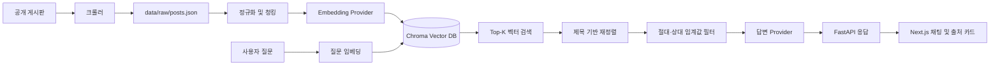

# SE Mentor Bot RAG Architecture

이 문서는 현재 RAG 구현의 데이터 흐름, 선택한 기술, 조정 가능한 값, 대안 및 변경 시 주의사항을 설명한다. 코드를 변경하기 전에 이 문서와 `.env.example`을 함께 확인한다.

## 1. 현재 운영 상태

- 데이터: 금오공과대학교 소프트웨어전공 공개 게시글 46건
- 인덱스: 900자 청크 79개, Chroma 영속 컬렉션
- 실행 provider: `local`
- 임베딩: `local-hash-embedding-v1`, 1,536차원
- 답변: `local-extractive-answer-v1` 추출형 답변
- SE 게시판: 크롤러는 구현되어 있으나 실제 화면 구조 검증은 보류
- OpenAI: 코드 경로는 구현되어 있으나 현재 키 할당량 문제로 운영하지 않음

현재 로컬 provider는 LLM이 아니다. 질문과 문서를 해시 벡터로 비교하고 검색된 원문 문장을 템플릿으로 반환한다.

## 2. 전체 흐름



파이프라인은 오프라인 인덱싱과 온라인 질의로 나뉜다.

```text
오프라인: crawl → raw JSON → chunk → embed → Chroma upsert
온라인: question → embed → cosine search → rerank → filter → answer + sources
```

## 3. 데이터 수집 계층

### 학과 게시판

`KumohBoardCrawler`는 `httpx + BeautifulSoup`을 사용한다. 목록의 `articleNo`를 canonical URL로 변환해 고정 공지 중복을 방지한다. 상세 페이지에서 제목, 본문, 작성자, 작성일, 첨부파일 링크를 추출한다. 이미지 전용·삭제·일시 실패 게시글은 텍스트 임베딩 대상에서 제외한다.

### SE 게시판

다음 순서로 선택한다.

1. `SEBOARD_API_URL`이 있으면 공개 JSON API 사용
2. 없으면 headless Selenium으로 렌더링 후 링크와 본문 탐색
3. 두 방식 모두 실패하면 `--allow-partial`로 학과 게시판만 저장

로그인 우회, CAPTCHA 무력화, 접근제어 회피는 범위 밖이다. API 응답 필드는 여러 후보명(`id`, `postId`, `title`, `subject`, `content`, `body` 등)을 허용하지만 실제 API가 확인되면 명시적 스키마로 좁히는 것이 좋다.

### 원본 스키마

`BoardPost`는 다음 정보를 보존한다.

| 필드 | 용도 |
| --- | --- |
| `id`, `source` | 원본 식별 및 중복 제거 |
| `title`, `content` | 검색·답변 본문 |
| `author`, `published_at` | 답변 맥락과 최신성 판단 |
| `url` | 사용자에게 제공할 canonical 출처 |
| `attachments` | 첨부 이름·링크 보존; 현재 본문은 미추출 |
| `crawled_at` | 수집 시점 추적 |

원본은 `data/raw/posts.json`에 UTF-8 JSON으로 저장한다. 벡터 DB를 원본 저장소로 사용하지 않는다.

## 4. 정규화와 청킹

`chunking.py`는 공백과 과도한 줄바꿈을 정리한 뒤 다음 헤더를 본문 앞에 추가한다.

```text
제목: <게시글 제목>
작성일: <게시일>
본문: <게시글 본문>
```

기본값은 `chunk_size=900`, `overlap=150` 문자다. 청크 경계는 마지막 180자 안에서 줄바꿈, 문장 끝(`. `, `다. `), 공백 순으로 찾는다. 토큰 기반이 아닌 문자 기반을 선택한 이유는 짧은 한국어 공지와 100건 규모에서 구현·디버깅이 단순하기 때문이다.

선택지와 교체 기준:

| 방식 | 장점 | 단점 | 사용 시점 |
| --- | --- | --- | --- |
| 현재 문자 청킹 | 빠르고 재현 가능 | 표·목록 문맥이 끊길 수 있음 | 프로토타입 |
| 토큰 청킹 | 모델 한도를 정확히 관리 | tokenizer 의존성 | 긴 문서 증가 시 |
| 제목/문단 의미 청킹 | 공지 구조 보존 | 파서 복잡도 증가 | PDF/HWP 포함 시 |
| 문서 단위 임베딩 | 구현이 가장 단순 | 긴 글 검색 정확도 저하 | 매우 짧은 게시글만 있을 때 |

청크 크기·overlap·본문 정제 방식이 바뀌면 전체 인덱스를 재생성한다.

## 5. Provider 선택

`AIProvider`는 `embed(texts)`와 `answer(question, contexts)` 두 메서드로 추상화된다. `provider_factory.py`가 다음 규칙으로 구현체를 선택한다.

| `AI_PROVIDER` | 동작 |
| --- | --- |
| `local` | API 키와 무관하게 로컬 해시/추출형 사용 |
| `openai` | `OPENAI_API_KEY` 필수 |
| `auto` | 키 문자열이 있으면 OpenAI, 없으면 로컬 |

주의: `auto`는 키의 할당량까지 시험하지 않는다. 키는 있으나 quota가 없으면 자동으로 로컬로 전환되지 않고 API 오류가 발생한다. 운영에서는 `local` 또는 `openai`를 명시하는 편이 안전하다.

### 로컬 임베딩

`LocalHashProvider`는 한국어·영문·숫자 토큰과 공백을 제거한 2~4글자 조각을 Blake2b로 1,536차원에 투영하고 L2 정규화한다.

- 일반 단어 가중치: `2.5`
- 문자 2/3/4-gram 가중치: `0.7 / 1.0 / 0.8`
- 제목 단어 가중치: `6.0`
- 제목 문자 조각 가중치: `2.0`

장점은 외부 모델, GPU, 다운로드, 비용이 없고 결과가 결정적이라는 점이다. 단점은 의미 유사성이 아니라 어휘 중복에 강하므로 동의어·의도 이해가 약하다는 점이다.

### OpenAI 임베딩·답변

`OpenAIProvider`는 문서를 64개씩 Embeddings API에 보내며 기본 모델은 `text-embedding-3-small`이다. 답변은 Responses API의 `output_text`를 사용한다. 프롬프트는 검색된 자료 밖의 추측 금지, 충돌 고지, 날짜 재확인, `[자료 N]` 표기를 요구한다.

OpenAI 경로는 더 자연스러운 종합 답변과 의미 검색에 유리하지만 API 키, quota, 네트워크, 비용 관리가 필요하다.

### 가장 중요한 인덱스 불변조건

문서 인덱싱과 질문 검색은 반드시 같은 provider·임베딩 모델·차원을 사용해야 한다. 로컬과 `text-embedding-3-small`은 모두 1,536차원일 수 있지만 벡터 의미는 완전히 다르다. 다음 값 중 하나라도 변경하면 반드시 실행한다.

```powershell
backend/.venv/Scripts/python -m backend.scripts.index --reset
```

- `AI_PROVIDER`
- `OPENAI_EMBEDDING_MODEL`
- 로컬 해시 feature 또는 가중치
- 임베딩 차원
- 청킹·정규화 방식
- 원본 게시글 집합

현재 Chroma 컬렉션은 embedding fingerprint를 검증하지 않는다. 추후 컬렉션 metadata에 provider, 모델, 차원, 청킹 버전을 저장하고 질의 시 불일치를 거부해야 한다.

## 6. Vector Store 선택

현재 저장소는 로컬 영속형 Chroma이며 cosine 공간을 사용한다. 검색 점수는 우선 `1 - cosine_distance`로 변환한다.

| 선택지 | 적합한 상황 | 고려사항 |
| --- | --- | --- |
| Chroma | 로컬 프로토타입, 수백~수만 청크 | 배포·동시성·백업 기능 제한 |
| PostgreSQL + pgvector | 기존 PostgreSQL 운영 | 스키마·인덱스 운영 필요 |
| Qdrant/Weaviate | 독립 벡터 서비스 필요 | 추가 인프라 |
| OpenAI Vector Store | 관리형 검색을 선호 | 벤더 의존성과 비용 |

현재 79청크에서는 Chroma가 충분하다. 다중 서버, 사용자별 컬렉션, 대규모 증분 인덱싱이 필요해지면 pgvector 또는 전용 벡터 DB를 검토한다.

## 7. 검색·재정렬·필터링

온라인 질의는 다음 순서다.

1. 질문을 현재 provider로 임베딩
2. Chroma cosine 검색으로 `RAG_TOP_K`개 조회
3. 질문의 2글자 이상 단어가 제목에 포함되면 단어당 `+0.08` 점수 보정
4. `RAG_MIN_SCORE`보다 낮은 결과 제거
5. 최고 점수의 75%보다 낮은 결과 제거
6. 결과가 없으면 LLM/provider를 호출하지 않고 `grounded=false` 반환

따라서 API의 `source.score`는 순수 cosine 점수가 아니라 제목 보정이 포함된 최종 랭킹 점수다. 제목 보정은 벡터 검색 Top-K 안에서만 적용되므로 Top-K 밖의 문서를 복구하지 못한다.

현재 운영 로컬 설정은 `top_k=5`, `min_score=0.09`다. `.env.example`의 `0.20`은 OpenAI 임베딩용 보수적 시작값이다. provider를 변경하면 평가 질문으로 임계값을 다시 튜닝한다.

향후 검색 품질 선택지:

- BM25 + vector hybrid 검색으로 정확한 과목명·약어 강화
- cross-encoder reranker로 Top-K 재정렬
- 게시일, 카테고리, source metadata 필터
- “최신”, “이번 학기” 질문에 시간 감쇠 적용
- query rewriting 또는 동의어 사전

## 8. 답변과 출처

### 로컬 답변

질문 토큰과 겹치는 문장을 우선 선택하고 다음 문장까지 최대 360자로 추출한다. URL이 같은 청크는 한 번만 사용하며 최대 세 게시글을 `[자료 N]`으로 표시한다. 이는 요약·추론 모델이 아니므로 문장 연결이 어색할 수 있다.

### OpenAI 답변

필터된 청크 전체를 제목, 작성일, source와 함께 모델에 전달한다. 모델 답변과 별개로 API는 검색 결과 metadata에서 `sources`를 생성한다. 모델이 URL을 만들어 내게 하지 않고 애플리케이션이 canonical URL을 제공하는 구조다.

`ChatResponse`:

```json
{
  "answer": "... [자료 1]",
  "sources": [
    {
      "title": "공지 제목",
      "url": "https://...",
      "source": "kumoh",
      "published_at": "2026-03-19",
      "score": 0.31
    }
  ],
  "grounded": true
}
```

프론트엔드는 `sources`를 신뢰 가능한 링크 카드로 렌더링한다. 학사 정보는 시간이 지나면 무효가 될 수 있으므로 답변 끝에 원문·마감일 재확인을 안내한다.

## 9. 구성값과 운영

| 환경변수 | 기본값 | 역할 |
| --- | --- | --- |
| `AI_PROVIDER` | `auto` | provider 선택 |
| `OPENAI_CHAT_MODEL` | `gpt-5.6-luna` | OpenAI 답변 모델 |
| `OPENAI_EMBEDDING_MODEL` | `text-embedding-3-small` | OpenAI 임베딩 모델 |
| `CHROMA_PATH` | `./chroma_db` | 벡터 저장 위치 |
| `CHROMA_COLLECTION` | `se_mentor_posts` | 컬렉션 이름 |
| `RAW_POSTS_PATH` | `./data/raw/posts.json` | 원본 JSON |
| `RAG_TOP_K` | `5` | 초기 벡터 검색 수 |
| `RAG_MIN_SCORE` | `0.20` | 절대 임계값 |
| `CRAWLER_DELAY_SECONDS` | `1.0` | 사이트 요청 간격 |
| `SEBOARD_API_URL` | 빈 값 | 확인된 공개 API 주소 |

일반 작업 순서:

```powershell
# 1. 데이터 수집; SE 실패를 허용하려면 --allow-partial
backend/.venv/Scripts/python -m backend.scripts.crawl --kumoh-limit 50 --seboard-limit 50 --allow-partial

# 2. provider 또는 데이터 변경 후 전체 인덱싱
backend/.venv/Scripts/python -m backend.scripts.index --reset

# 3. 서버 재기동
docker compose up -d --build

# 4. 상태 확인
Invoke-RestMethod http://localhost:8000/api/health
```

`/api/health`에서 provider, 모델명, 인덱싱 청크 수를 확인한다. 인덱스가 비어 있으면 채팅 API는 `409`, OpenAI 호출 실패는 `502`를 반환한다.

## 10. 테스트와 평가

현재 단위 테스트는 청킹, 학과 게시판 파싱, 저장 중복 제거, Chroma 최근접 검색, RAG 임계값, 로컬 임베딩 결정성 및 출처 표기를 검사한다.

```powershell
backend/.venv/Scripts/python -m ruff check backend
backend/.venv/Scripts/python -m pytest backend/tests
```

검색 품질 변경 시 `data/evaluation/questions.json`을 확장해 다음을 기록한다.

- 기대 문서가 Top-1/Top-3/Top-5에 포함되는지
- 범위 밖 질문이 `grounded=false`인지
- 답변의 날짜·대상·신청 경로가 원문과 일치하는지
- 표시한 `[자료 N]`과 source 카드가 일치하는지
- provider별 지연시간, API 비용, 실패율

임계값은 소수의 성공 예시가 아니라 최소 30개 이상의 대표 질문으로 결정한다.

## 11. 확장 우선순위

1. SE 게시판의 실제 공개 API 또는 DOM 스키마 확정 및 fixture 테스트 추가
2. embedding fingerprint 저장·검증으로 잘못된 인덱스 사용 차단
3. BM25/vector hybrid 검색 및 카테고리·날짜 필터
4. PDF/HWP 첨부 텍스트 추출과 문서별 parser 분리
5. 증분 크롤링, 변경 감지, 삭제 문서 반영
6. 자동 평가 CLI와 검색/답변 품질 리포트
7. OpenAI quota 확보 후 local/OpenAI A/B 평가
8. 요청 ID, 검색 점수, 선택 문서, 지연시간 관측 로그

새 provider는 `AIProvider` 프로토콜을 구현하고 `provider_factory.py`에 등록한다. 새 데이터 소스는 `BoardPost`를 반환하도록 만들어 이후 청킹·검색 계층을 재사용한다.
