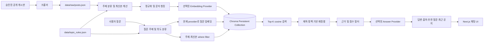

# RAG Overview

이 문서는 RAG의 안정적인 구조와 동작, 아직 구현되지 않은 확장 우선순위를 설명한다. 변동 가능한 건수·준비도·위험은 [`../PROJECT_STATUS.md`](../PROJECT_STATUS.md)를 단일 상태 문서로 확인한다.

## 현재 구현의 경계

- local provider는 결정적 hash embedding과 출처 기반 extractive answer를 제공한다.
- OpenAI provider는 OpenAI Embeddings API와 Responses API를 지원한다.
- API와 평가 CLI는 현재 설정·원본·주제 규칙·청킹·collection과 일치하는 strict index manifest가 있을 때만 질의 또는 평가를 진행한다.
- SE 게시판 수집은 robots 정책과 사용 권한을 확인한 뒤 운영자 서면 허가 또는 승인된 공식 API가 확보될 때까지 비활성 상태로 유지한다.

## 전체 흐름



오프라인과 온라인 경계는 다음과 같다.

```text
오프라인: crawl → raw JSON → topic/latest enrichment → normalize/chunk → embed → Chroma upsert + manifest
온라인: request → strict manifest check → topic/intent → query embed → latest-only Chroma search → rerank/evidence gate → answer + sources
```

## 아직 구현되지 않은 확장 우선순위

1. SE 데이터 계약과 승인된 공식 API 연동, fixture 기반 계약 테스트
2. BM25/vector hybrid 검색과 reranker
3. PDF/HWP 첨부 본문 parser
4. 증분 update/delete와 Chroma backup/restore
5. OpenAI quota 확보 후 provider A/B 평가와 별도 threshold calibration
6. 개인정보를 남기지 않는 request·검색·지연시간 observability

새 provider는 `AIProvider`의 `embed`·`answer` 계약을 구현하고 `provider_factory.py`에 등록한다. 새 source는 `BoardPost`를 반환해야 이후 주제 분류·청킹·검색 계층을 재사용할 수 있다.
