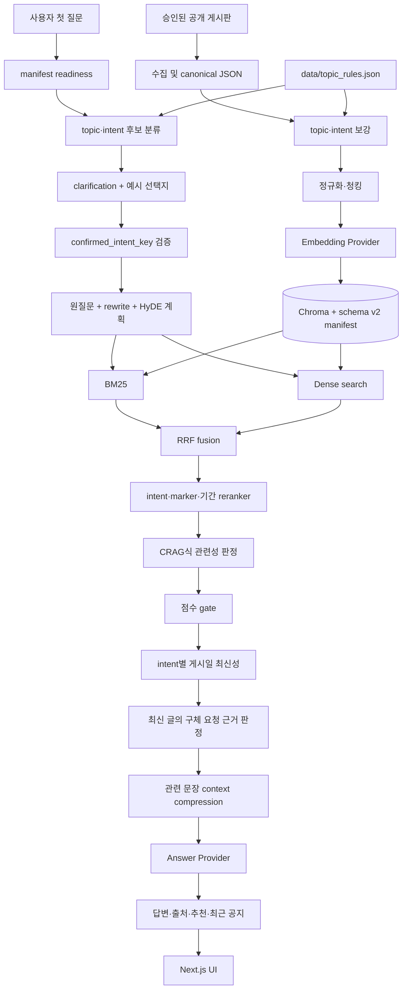

# RAG Overview

이 문서는 정확도 우선 RAG의 안정적인 전체 흐름과 아직 구현되지 않은 운영 확장을 설명한다. 변동 가능한 건수·준비도·위험은 [`../PROJECT_STATUS.md`](../PROJECT_STATUS.md)를 단일 상태 문서로 확인한다.

## 현재 구현의 경계

- local provider는 결정적 hash embedding과 출처 기반 extractive answer를 제공한다.
- OpenAI provider는 OpenAI Embeddings API와 Responses API를 지원하지만 현재 품질 snapshot은 local provider 기준이다.
- API와 평가 CLI는 schema v2 strict index manifest가 현재 설정·원본·intent 규칙·청킹·collection과 일치할 때만 진행한다.
- 모든 첫 질문은 의도 확인을 거친다. 확인되지 않은 intent에서는 embedding, vector store, answer provider를 호출하지 않는다.
- SE 게시판 수집은 운영자 서면 허가 또는 승인된 공식 API가 확보될 때까지 비활성 상태다.

## 전체 흐름



오프라인과 온라인 경계는 다음과 같다.

```text
오프라인: crawl → raw JSON → topic/intent enrichment → normalize/chunk → embed → Chroma + manifest
온라인 1차: request → manifest → intent candidates → clarification
온라인 2차: confirmed intent → query plan → BM25+dense RRF → rerank → CRAG → score → freshness → request evidence → compression → answer
```

## 정확도 우선 불변조건

1. `confirmed_intent_key`는 현재 질문에서 제시된 선택지 중 하나여야 한다.
2. dense 또는 lexical 점수 한 종류만 높다고 답변하지 않는다. marker와 두 검색 신호를 CRAG gate에서 함께 판정한다.
3. 명시된 연도·학기와 충돌하는 문서는 제외한다.
4. 최신성은 확인 intent 단위로 적용한다. 최신 글이 세부 요청과 맞지 않아도 오래된 글로 자동 후퇴하지 않는다.
5. `no_answer`는 빈 `sources`를 유지하며 answer provider를 호출하지 않는다.
6. source URL·제목·게시일은 모델 생성값이 아니라 보존된 metadata에서 만든다.

## 아직 구현되지 않은 확장 우선순위

1. 승인된 `course_openings`·`graduation` 공식 source 보강과 회귀평가
2. OpenAI provider A/B 평가와 raw candidate 분포 기반 threshold calibration
3. PDF/HWP 첨부 본문 parser
4. 증분 update/delete와 Chroma backup/restore
5. 개인정보를 남기지 않는 intent·거절 사유·검색 지연 observability와 rate limit
6. Docker/원격 CI/cross-browser E2E 운영 증거 자동화

새 provider는 `AIProvider.embed`·`answer` 계약을 구현하고 `provider_factory.py`에 등록한다. 새 source는 canonical URL과 게시일을 포함한 `BoardPost`를 반환해야 이후 분류·청킹·검색 계층을 재사용할 수 있다.
