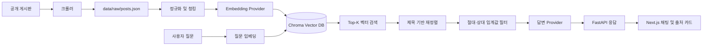

# RAG Overview

이 문서는 현재 RAG 구현의 운영 상태, 전체 흐름, 확장 우선순위를 설명한다.

## 현재 운영 상태

- 데이터: 금오공과대학교 소프트웨어전공 공개 게시글 46건
- 인덱스: 900자 청크 79개, Chroma 영속 컬렉션
- 실행 provider: `local`
- 임베딩: `local-hash-embedding-v1`, 1,536차원
- 답변: `local-extractive-answer-v1` 추출형 답변
- SE 게시판: 크롤러는 구현되어 있으나 실제 화면 구조 검증은 보류
- OpenAI: 코드 경로는 구현되어 있으나 현재 키 할당량 문제로 운영하지 않음

현재 로컬 provider는 LLM이 아니다. 질문과 문서를 해시 벡터로 비교하고 검색된 원문 문장을 템플릿으로 반환한다.

## 전체 흐름



파이프라인은 오프라인 인덱싱과 온라인 질의로 나뉜다.

```text
오프라인: crawl → raw JSON → chunk → embed → Chroma upsert
온라인: question → embed → cosine search → rerank → filter → answer + sources
```

## 확장 우선순위

1. SE 게시판의 실제 공개 API 또는 DOM 스키마 확정 및 fixture 테스트 추가
2. embedding fingerprint 저장·검증으로 잘못된 인덱스 사용 차단
3. BM25/vector hybrid 검색 및 카테고리·날짜 필터
4. PDF/HWP 첨부 텍스트 추출과 문서별 parser 분리
5. 증분 크롤링, 변경 감지, 삭제 문서 반영
6. 자동 평가 CLI와 검색/답변 품질 리포트
7. OpenAI quota 확보 후 local/OpenAI A/B 평가
8. 요청 ID, 검색 점수, 선택 문서, 지연시간 관측 로그

새 provider는 `AIProvider` 프로토콜을 구현하고 `provider_factory.py`에 등록한다. 새 데이터 소스는 `BoardPost`를 반환하도록 만들어 이후 청킹·검색 계층을 재사용한다.
