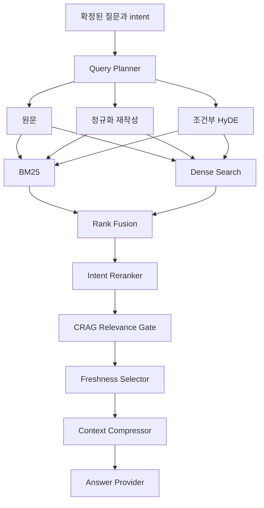

# Accuracy-First Intent Confirmation And Hybrid RAG Design

## 1. 배경

현재 온라인 질의 흐름은 질문을 넓은 `topic_key` 하나로 분류한 뒤
`is_latest_topic=true`를 먼저 적용한다. 그 결과 같은 넓은 주제 안에 있는 서로
다른 업무가 하나의 최신 게시글로 축약된다.

실제 데이터에서 “최근 수강신청 공지를 알려줘”는 `registration`으로 올바르게
분류되지만, 검색 전 최신성 필터 때문에 2026-06-16 조기취업자 출석인정신청
게시글만 남는다. 이 게시글은 수강신청 근거 정책에서 탈락하므로 답변이 거절된다.
최신성 필터를 제외하면 2026-02-26 수강신청 변경 안내와 2026-02-11 일반
수강신청 안내가 높은 점수로 검색된다.

“컴퓨터 소프트웨어 공학과에 대해 알려줘”처럼 범위가 넓은 질문은 `general`로
분류된 뒤 제목의 “소프트웨어” 중복만으로 교원 초빙 공지가 채택될 수 있다.
이는 사용자의 실제 요청을 확인하지 않고 검색을 시작하고, 단일 제목 중복을
관련성 근거로 과대평가하기 때문이다.

## 2. 목표

- 속도와 답변률보다 근거 정확도를 우선한다.
- 모든 자유 입력 질문은 사용자가 구조화된 의도를 확인한 뒤에만 검색한다.
- BM25와 Dense 검색을 독립 수행하고 합의 결과를 재정렬한다.
- 관련성 판정이 끝난 뒤에만 같은 세부 주제의 최신 게시글을 선택한다.
- 불확실하거나 충돌하는 근거로 답변하지 않는다.
- 답변 근거와 별도의 최근 공지를 시각적으로 구분한다.
- 단계별 모듈을 분리해 각 정책을 독립적으로 테스트하고 교체할 수 있게 한다.

## 3. 비목표

- 승인되지 않은 SE 게시판 수집을 활성화하지 않는다.
- PDF와 HWP 첨부파일 본문 파싱을 추가하지 않는다.
- 사용자 대화 내용을 서버에 영구 저장하지 않는다.
- 근거가 없는 학과 소개 문장을 모델의 일반 지식으로 생성하지 않는다.
- 검색 결과가 없을 때 외부 웹 검색으로 자동 우회하지 않는다.

## 4. 정확도 정책

정확도는 “항상 답변하는 비율”이 아니라 “grounded 답변이 틀리지 않는 비율”로
정의한다. 다음 fail-closed 규칙을 적용한다.

1. 확인되지 않은 자유 입력 의도로 검색하지 않는다.
2. 연도, 학기, 세부 주제가 충돌하면 후보를 제거한다.
3. 독립된 검색 또는 정책 신호가 합의하지 않으면 답변을 보류한다.
4. 관련 문서가 없으면 모델을 호출하지 않는다.
5. 답변에 사용한 모든 게시글은 제목, 게시일, canonical URL을 표시한다.
6. 고정밀 semantic provider가 없을 때는 lexical 근거를 완화하지 않는다.
7. 관련성보다 최신성을 먼저 적용하지 않는다.

## 5. 의도 모델

질문 의도는 넓은 topic 하나가 아니라 다음 구조로 표현한다.

```text
topic_key: registration
intent_key: registration.main
action: latest_notice
year: 2026 | null
term: first | second | summer | winter | null
recency_requested: true
entities: [...]
```

초기 세부 의도는 다음과 같다.

| topic | intent key | 의미 |
| --- | --- | --- |
| registration | `registration.main` | 일반 수강신청 일정과 안내 |
| registration | `registration.change` | 수강 변경·정정 |
| registration | `registration.course_basket` | 수강꾸러미 |
| registration | `registration.attendance` | 조기취업자 출석인정 |
| course_openings | `course_openings.lookup` | 개설강좌 조회 |
| capstone | `capstone.general` | 캡스톤디자인 |
| career | `career.general` | 진로·채용·인턴 |
| scholarship | `scholarship.general` | 장학 |
| graduation | `graduation.general` | 졸업요건 |
| general | `general.recent` | 전체 최신 공지 |
| general | `department.overview` | 학과 소개·교육과정 요청 |

`department.overview`는 현재 게시글 snapshot만으로 근거가 부족할 수 있다. 이
의도가 확인되면 교원 초빙 공지로 대신 답하지 않고, 학과 소개 공식 자료가
수집되지 않았음을 알린다.

세부 intent는 `data/topic_rules.json`의 각 topic 아래에 선언한다. 각 규칙은
`key`, `label`, `keywords`, `evidence_markers`, `exclusion_markers`, `example`을
가진다. 코드에 수강신청 전용 분기문을 흩어 놓지 않고 같은 catalog를 게시글
분류, 질문 후보 생성, rerank, 평가에서 공유한다.

## 6. 의도 확인 흐름

### 6.1 자유 입력

자유 입력에는 항상 clarification 응답을 반환한다. 응답은 다음을 포함한다.

- 원문 질문
- 가장 가능성 높은 의도 설명
- 최대 3개의 구조화된 선택지
- 각 선택지가 검색할 범위와 예시

예를 들어 “최근 수강신청 공지를 알려줘”에는 다음 선택지를 제시한다.

1. 일반 수강신청 일정과 공지
2. 수강신청 변경·정정 공지
3. 수강꾸러미 공지

### 6.2 의도 확정

사용자가 선택하면 프론트엔드는 원문 질문과 선택한 `intent_key`를 다시 보낸다.
백엔드는 원문 질문을 다시 분석해 해당 선택지가 허용된 후보인지 검증한다.
임의의 intent key나 변경된 질문은 새 clarification을 요구한다. 서버 세션과
대화 영구 저장은 필요하지 않다.

### 6.3 추천 버튼

서버가 clarification 응답으로 만든 선택 버튼은 선택 시 확정 의도로 전송된다.
일반 답변 뒤의 추천 질문은 새 질문이므로 다시 의도 확인을 거친다.

## 7. API 계약

`ChatRequest`는 다음 필드를 사용한다.

```json
{
  "question": "최근 수강신청 공지를 알려줘",
  "confirmed_intent_key": null
}
```

`ChatResponse.response_type`은 다음 중 하나다.

- `clarification`: 검색 전 의도 확인 필요
- `answer`: 검증된 근거 기반 답변
- `no_answer`: 확인된 의도에 맞는 근거 부족

clarification 응답은 다음 구조를 추가한다.

```json
{
  "response_type": "clarification",
  "answer": "질문 의도를 이렇게 이해했습니다. 무엇을 찾을지 선택해 주세요.",
  "grounded": false,
  "interpreted_intent": {
    "topic_key": "registration",
    "intent_key": "registration.main",
    "label": "일반 수강신청 일정과 공지"
  },
  "clarification_options": [
    {
      "intent_key": "registration.main",
      "label": "일반 수강신청 공지",
      "example": "2026학년도 수강신청 일정과 유의사항"
    }
  ],
  "sources": [],
  "suggested_questions": [],
  "recent_notices": []
}
```

기존 answer 필드는 유지해 프론트엔드 메시지 렌더링 경로를 재사용한다.

## 8. 검색 파이프라인



### 8.1 Query Planner

원문은 항상 유지한다. 확인된 intent의 키워드, alias, 연도, 학기를 사용해
결정적인 재작성문을 만든다. 초기 구현의 HyDE는 확인된 intent의 label, marker,
시간 조건으로 만드는 짧은 결정적 가상 공지문이다. 모델이 사실이나 날짜를
추측하게 하지 않는다. HyDE는 실제 근거로 사용하지 않고 후보 검색에만 사용한다.
생성된 HyDE가 확인된 intent의 필수 marker를 포함하지 않으면 폐기한다.

### 8.2 BM25

현재 규모에서는 Chroma에 저장된 청크를 읽어 메모리 내 Okapi BM25 corpus를
구축한다. 한국어 공백 token과 compact character n-gram을 함께 사용한다. 별도
생성 인덱스를 Git에 포함하지 않는다.

### 8.3 Dense Search

현재 provider의 embedding을 사용한다. local hash embedding은 보조 신호로만
취급하고, 그것만으로 후보를 relevant로 승격하지 않는다. semantic embedding을
사용해도 Dense 결과 하나만으로 답변을 허용하지 않는다.

### 8.4 Rank Fusion

BM25와 Dense의 서로 다른 점수 범위를 직접 더하지 않고 Reciprocal Rank Fusion을
사용한다. URL과 chunk id로 중복을 제거하되 검색 신호별 rank를 보존한다.

### 8.5 Reranker

다음 feature를 명시적으로 계산한다.

- 확인된 intent marker의 제목 포함 여부
- 본문 marker 포함 여부
- BM25 rank와 Dense rank
- 질문의 distinctive term 중복
- 연도와 학기 일치
- 다른 세부 intent의 배제 marker
- 게시일은 동점 해소에만 사용

하나의 긴 단어가 제목에 포함됐다는 이유만으로 general 질문을 채택하지 않는다.

### 8.6 CRAG 관련성 판정

후보를 `relevant`, `ambiguous`, `irrelevant`로 분류한다.

- `relevant`: 필수 marker와 시간 조건이 맞고 독립 신호 2개 이상이 합의
- `ambiguous`: 세부 의도는 가능하지만 marker 또는 검색 합의가 부족
- `irrelevant`: 의도, 연도, 학기 또는 배제 marker가 충돌

relevant가 없고 ambiguous가 있으면 구체적인 재질문을 반환한다. 둘 다 없으면
`no_answer`를 반환하며 answer provider를 호출하지 않는다.

## 9. 관련성 이후 최신성

온라인 검색에서 `is_latest_topic=true`를 사전 where 조건으로 사용하지 않는다.
먼저 broad topic 범위에서 후보를 검색하고 CRAG를 통과시킨다.

관련 후보는 `intent_key`와 canonical URL 기준으로 묶는다. 동일 intent에서 여러
게시글이 남으면 파싱 가능한 `published_at`, `crawled_at` 순으로 가장 최신 문서를
선택한다. 날짜가 없는 문서는 날짜가 있는 문서보다 우선할 수 없다.

확정 의도가 `registration.main`이면 출석인정과 수강꾸러미 문서는 최신이어도
경쟁 후보가 아니다. broad recent intent를 지원할 때는 세부 intent별 최신 1건을
뽑은 뒤 전체 게시일 순으로 정렬한다.

오프라인 `is_latest_topic` metadata는 감사와 이전 인덱스 호환을 위해 유지하지만
최종 답변 선택의 유일한 조건으로 사용하지 않는다.

## 10. Context Compression과 답변

관련 문서마다 제목과 확인된 intent term에 가장 많이 겹치는 문장을 선택한다.
각 문서는 최대 3문장, 전체 context는 설정 가능한 문자 수로 제한한다. 제목,
게시일, source, URL metadata는 압축하지 않는다.

local provider는 압축된 문장만 추출해 답한다. OpenAI provider도 제공된 context
밖의 사실을 사용하지 않도록 지시한다. 모델이 만든 URL은 사용하지 않고 앱의
metadata로 source 카드를 만든다.

답변 문장은 `[자료 n]` 표기를 사용하고 source 순서와 일치해야 한다. 신청 가능
여부와 마감일은 원문 재확인 안내를 유지한다.

## 11. 최근 공지와 추천 질문

clarification 단계에서는 최근 공지를 표시하지 않는다. 의도 선택을 방해하지 않기
위함이다.

answer 단계에서는 확인된 세부 intent와 관련된 최신 공지를 먼저 표시한다.
no-answer 단계에서 최근 공지를 표시할 경우 “답변 근거와 별개인 참고용 최근
공지”로 명확하게 표기한다. 최근 공지는 답변의 source로 간주하지 않는다.

추천 질문은 문자열뿐 아니라 대상 topic과 intent가 검증 가능한 구조로 내부에서
관리한다. 일반 추천 질문을 클릭하면 새 자유 질문과 동일하게 clarification을
거친다.

## 12. 프론트엔드 UX

- clarification 메시지는 일반 답변과 다른 테두리와 “질문 의도 확인” 제목을 쓴다.
- 가장 가능성 높은 선택지를 첫 번째에 표시하되 자동 선택하지 않는다.
- 선택 버튼에는 의도 label과 한 줄 예시를 표시한다.
- 사용자가 선택하면 동일 질문을 중복 말풍선으로 추가하지 않고 “선택한 의도”를
  시스템 상태로 표시한 뒤 검색한다.
- answer, no-answer, 네트워크 오류를 시각적으로 구분한다.
- recent notices가 source처럼 보이지 않도록 별도 설명을 붙인다.
- 키보드와 screen reader로 선택 버튼을 사용할 수 있어야 한다.

## 13. 오류 처리

- 알 수 없는 `confirmed_intent_key`: 422 대신 새 clarification 응답
- 원문 질문과 선택 intent 충돌: clarification 재요청
- BM25 corpus 또는 Chroma 사용 불가: 503과 안전한 사용자 메시지
- 한 검색 신호만 실패: 정확도 모드에서는 답변을 생성하지 않고 unavailable 처리
- 관련 후보 없음: `no_answer`, HTTP 200
- ambiguous만 존재: 더 구체적인 clarification, HTTP 200
- answer provider 실패: 502, 내부 상세나 credential 미노출
- 날짜 파싱 실패: 최신 후보에서 후순위 처리하고 source에는 원본 값을 유지

## 14. 모듈 경계

예상 백엔드 모듈은 다음과 같다.

- `intent_analysis.py`: intent 후보 생성과 확인 검증
- `query_planner.py`: 검색문 변형
- `lexical_retriever.py`: BM25 계산
- `hybrid_retriever.py`: 후보 생성과 RRF
- `reranker.py`: intent·시간 feature 점수
- `relevance_gate.py`: CRAG 판정
- `freshness_selector.py`: 관련 후보의 최신성 선택
- `context_compressor.py`: 문장 단위 압축
- `rag.py`: 위 컴포넌트 조정

`rag.py`는 정책 세부 계산을 직접 구현하지 않는다. 각 모듈은 dataclass 또는
Pydantic model 기반의 명시적 입력과 출력을 사용한다.

## 15. 테스트 전략

### 단위 테스트

- 자유 질문에서 복수 intent 후보 생성
- 확인 intent 검증과 임의 key 거절
- 수강신청 네 가지 세부 intent 분류
- query rewrite가 원문과 시간 조건 보존
- BM25 결과와 Dense 결과의 RRF
- 시간 충돌과 exclusion marker rerank
- CRAG 세 상태 판정
- 관련성 판정 후 최신 문서 선택
- context compression의 문장과 metadata 보존

### 통합 테스트

- 첫 자유 질문은 provider를 호출하지 않고 clarification 반환
- 확인 후에만 retrieval과 answer 실행
- “최근 수강신청 공지를 알려줘”가 출석인정 글을 근거로 쓰지 않음
- 일반 수강신청 intent가 2026-02-11 또는 더 최신의 실제 일반 수강신청 공지를
  반환
- 변경·정정 intent가 2026-02-26 변경 공지를 반환
- “컴퓨터 소프트웨어 공학과에 대해 알려줘”가 교원 초빙 공지를 답하지 않음
- no-answer에서도 추천과 최근 공지의 의미가 분리됨

### 프론트엔드 테스트

- clarification option 렌더링과 선택 요청 payload
- 의도 선택 중 중복 사용자 말풍선 방지
- answer와 no-answer 표시 구분
- 참고용 최근 공지 label
- loading, timeout, network, invalid payload 상태

### 품질 게이트

- 필수 회귀 질문의 잘못된 grounded 답변 0건
- 확인되지 않은 자유 입력의 직접 answer 0건
- grounded source의 intent 및 시간 조건 일치율 100%
- latest-only 검증은 broad topic이 아니라 확인된 intent 기준 100%
- 백엔드 전체 coverage 85% 이상 유지
- frontend test, typecheck, lint, production build 통과

답변 보류 증가는 허용하지만 잘못된 grounded 답변은 허용하지 않는다.

## 16. 마이그레이션

topic rules에 intent rule schema를 추가하면 manifest fingerprint가 바뀌므로 반드시
재인덱싱한다. 기존 `topic_key`, `topic_label`, `is_latest_topic` metadata는 유지하고
`intent_key`를 추가한다. 이전 인덱스는 strict manifest 검사에서
`needs_reindex`로 처리한다.

API와 프론트엔드는 같은 변경 집합으로 배포한다. 기존 response field를 유지하되
`response_type`, `interpreted_intent`, `clarification_options`를 추가한다.

## 17. 완료 기준

1. 모든 자유 입력이 intent clarification을 먼저 반환한다.
2. 선택한 intent가 검증된 뒤에만 검색한다.
3. BM25와 Dense 검색 결과를 독립 생성하고 합의 재정렬한다.
4. CRAG 이후에 세부 intent별 최신 문서를 선택한다.
5. 두 보고된 실패 질문이 잘못된 grounded 답변을 만들지 않는다.
6. 수강신청 질문이 실제 수강신청 공지를 근거로 답할 수 있다.
7. 출처, 날짜, 추천 질문, 최근 공지 UI가 의미별로 분리된다.
8. 문서와 평가 데이터가 새 파이프라인을 설명한다.
9. 전체 자동화 검증이 통과하고 작업 트리가 깨끗하다.
